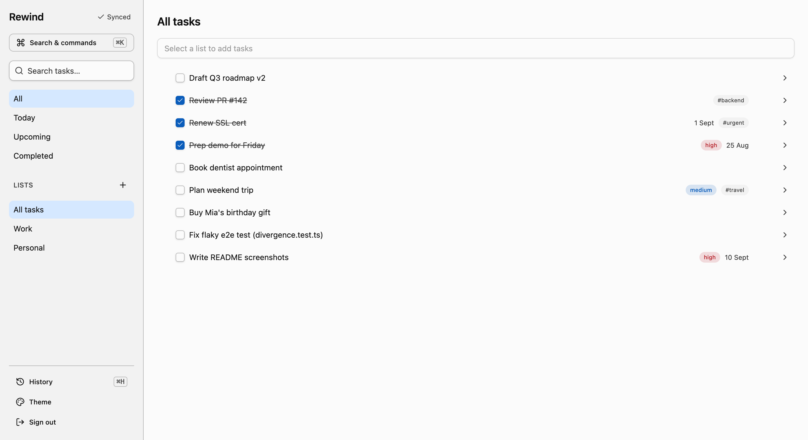
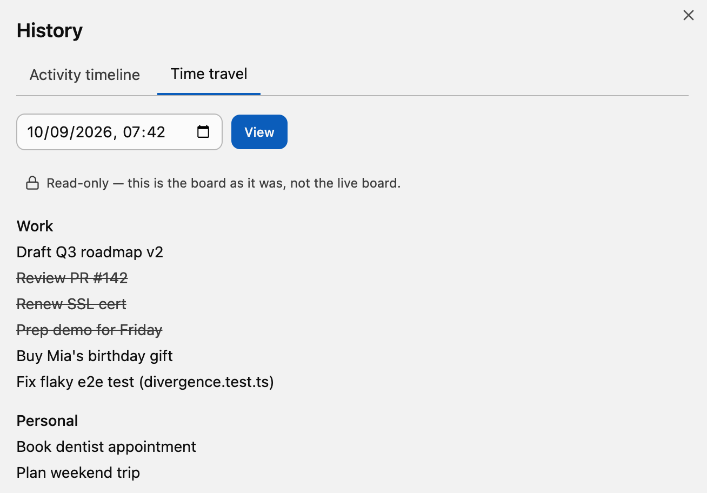
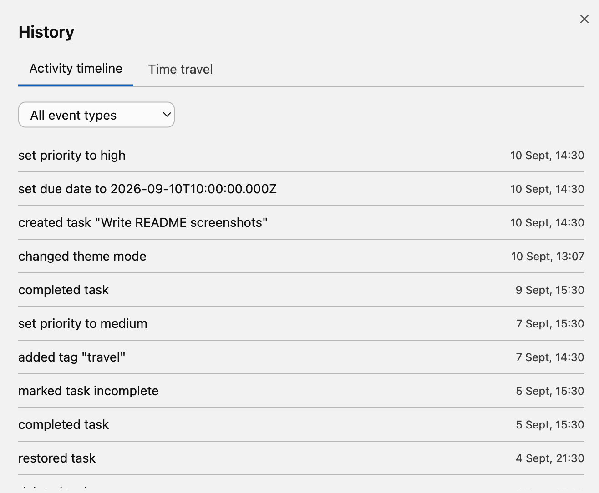
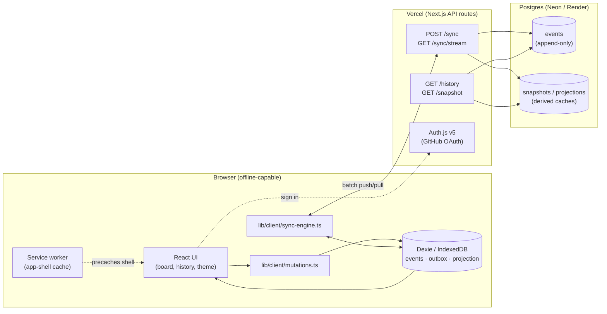

# Rewind

**An offline-first task manager that never forgets — every change is an
event, so your whole history is scrubbable like a video timeline, and two
devices editing the same task offline both win.**

🔗 **Live demo:** [rewind-eosin-nu.vercel.app](https://rewind-eosin-nu.vercel.app)
— sign in with your own GitHub account; a new visitor starts with an empty
board (see "Design decisions and trade-offs" for why there's no public
read-only demo route).



**Time travel — the board as it was at any past instant, reconstructed by
replaying the event log up to that timestamp.** Not a snapshot that was
saved for you: the state is *derived*, so any instant in history is
addressable, not just the ones someone thought to bookmark.



**Every mutation, in order, with what actually changed.** This is the same
log the board is projected from — not a parallel audit trail that can drift
out of sync with the real state.



See [CLAUDE.md](CLAUDE.md) for the non-negotiable principles this repo is
built against, [docs/DECISIONS.md](docs/DECISIONS.md) for the reasoning
behind every non-obvious choice, and [docs/ARCHITECTURE.md](docs/ARCHITECTURE.md)
for sequence diagrams of an offline mutation, a sync round-trip, and a
conflict merge.

## Why event sourcing for a task app

A to-do list looks trivial until you want to know *when* a task became
overdue, let two phones edit the same list on a plane with no signal, or
give someone a real undo instead of a best-effort one — none of which a
table of current rows can answer, because the row overwrote the answer.
Storing every mutation as an immutable event instead of overwriting a row
turns "what changed, when, and why" from a feature you'd have to
retrofit with an audit table into the *only* way the app is built, which
is what makes time travel, true undo/redo, and offline multi-device sync
fall out of the same design rather than needing three separate bolt-ons.
The cost is real — every read is a projection computed from history
rather than a row you can just `SELECT`, and conflict resolution has to
be designed up front rather than "last write wins by accident" — which
is why the trade-offs below are spelled out rather than glossed over.

## Architecture



Every mutation writes to Dexie first (`Mutations` above) — the network
path (`SyncEngine` → `SyncAPI`) only ever runs afterward, opportunistically.
`Events` is the only source of truth on the server; `Snapshots`/
`projections` are caches rebuilt from it, never written to directly.

### Component map

- **Event log** ([lib/events/](lib/events/)) — 16 Zod-schema event types
  in a discriminated union, each carrying a UUIDv7 id, actor/device ids,
  a vector clock, and `{from, to}` for every value-replacing change.
- **Domain** ([lib/domain/](lib/domain/)) — `reduce(events) => AppState`,
  a pure function shared verbatim between server and client, so the two
  can never disagree about what a task looks like.
- **Database** ([lib/db/](lib/db/), [drizzle/](drizzle/)) — Postgres via
  Drizzle; `events` is append-only, enforced by a database trigger, not
  just application code.
- **Client** ([lib/client/](lib/client/)) — the local half of the same
  architecture: Dexie holds the full event log (not just a projection),
  an outbox queues unsynced writes, and a background engine drains it
  with exponential backoff.
- **Sync protocol** ([lib/sync/](lib/sync/), [app/api/sync/](app/api/sync/)) —
  one idempotent push+pull round trip; SSE for a live "something changed"
  nudge.
- **Theme** ([lib/theme/](lib/theme/), [app/globals.css](app/globals.css)) —
  every colour is an OKLCH CSS custom property; a custom accent is
  derived and WCAG-AA-validated, never hand-picked.
- **UI** ([app/](app/), [components/](components/)) — the task board,
  activity timeline, time-travel view, command palette, and theme
  editor, all reading the local projection.

## Design decisions and trade-offs

Full reasoning (including two rejected alternatives per decision and the
real bugs testing found) is in [docs/DECISIONS.md](docs/DECISIONS.md).
The headline calls:

- **Conflict resolution — operation-based merge, LWW-register default.**
  Most fields (title, due date, priority) are a plain last-writer-wins
  register; `tags` and `deleted` get their own merge strategy (add-wins,
  restore-wins) because a register would silently drop a concurrently-
  added tag or a concurrent delete/restore could destroy data. **The
  cost:** every field needs a considered merge rule instead of one
  uniform policy, and two concurrent renames still need an arbitrary
  (if deterministic) tiebreak — no merge strategy invents an intent that
  isn't there.
- **Snapshot cadence — every 200 events, keep the newest 3.** Bounds
  worst-case replay for a heavy user without a write in the read path
  (rejected: write-on-read) or unbounded storage growth (rejected:
  time-based cadence). **The cost:** the snapshot-resume path is an
  accepted "single winner per field" LWW simplification, not perfectly
  exact for a pathological 3-way-or-more concurrent edit straddling a
  snapshot boundary — real cadence makes that vanishingly rare in
  practice, and it's the same simplification most production LWW-CRDTs
  make.
- **Offline-first changes the whole data model, not just the network
  layer.** Once "every mutation writes locally first" is non-negotiable,
  a client can't just cache server responses — it needs its own copy of
  the append-only log, its own reducer, and its own conflict-resolution
  logic, all *identical* to the server's (this repo shares the literal
  `reduce()` function between both). That's why undo/redo had to move
  client-side too: a server round trip to find out what's undoable is
  incompatible with "network is an enhancement, never a requirement."
- **Theme token derivation — OKLCH, auto-corrected, never hand-picked.**
  A custom accent color derives a full light+dark palette and is checked
  against the real WCAG 2.x contrast formula on every rendered pair; a
  failing pair has its *lightness* nudged toward the accessible extreme
  (hue never changes) rather than being rejected outright. **The cost:**
  this is WCAG 2.x AA specifically, not the newer perceptual APCA
  algorithm — noted as a future upgrade path, not implemented.

## Features

- Lists, subtasks, drag-and-drop reorder, due dates, priorities, tags,
  notes — instant local reads, optimistic writes, works with the network
  off.
- **History** — an activity timeline, a per-task lifecycle view, and a
  read-only time-travel view that renders the whole board as it was at
  any past instant.
- **True undo/redo** — a visible, keyboard-bound stack that works
  offline, because it's a local stack, not a round trip.
- **Conflict-free sync** — edit the same task on two devices while both
  are offline; reconnect either one first, both edits survive.
- **A real theme system** — light/dark/system × three built-in accents ×
  a custom-color editor that won't let you save an inaccessible palette.
- **Command palette** (`⌘K`) and a fully keyboard-navigable UI with a
  discoverable shortcut sheet (`?`).
- **Installable PWA** — works, and loads, with the network genuinely off.

## Quickstart

```bash
git clone https://github.com/satyamsipah/rewind.git
cd rewind
pnpm install
cp .env.example .env   # see .env.example for what each variable needs and how to get it
pnpm db:migrate
pnpm dev
```

Every variable in `.env.example` is documented inline — what it's for,
how to generate or obtain it, and which are optional. Nothing needs to
be guessed.

## Testing strategy

```bash
pnpm typecheck
pnpm test         # unit + client + integration Vitest projects
pnpm test:e2e     # Playwright — needs a real, migrated Postgres
pnpm lint         # ESLint + a zero-hex-anywhere check
```

- **Unit** (`lib/events`, `lib/domain`, `lib/theme`, `lib/shared`) — pure
  functions, no I/O: every event type round-trips (apply → inverse →
  original state), the reducer is order-independent (property-tested
  with `fast-check`), and every derived theme passes real WCAG contrast
  math.
- **Client** (`lib/client`) — jsdom + `fake-indexeddb`, since Dexie
  genuinely needs a browser-shaped environment.
- **Integration** (`lib/db`, `lib/sync`) — against **PGlite**, real
  Postgres compiled to WASM, in-process: the append-only trigger and
  `FOR UPDATE` locking run for real, with no Docker dependency.
- **E2E** (Playwright + axe-core) — a genuine `context.setOffline(true)`
  scenario; two real browser contexts (two independent Dexie stores, the
  actual multi-device model) diverging offline and reconciling; a
  time-travel assertion against a real past instant; every built-in
  theme × mode combination scanned for contrast violations; and
  accessibility scans across six main views.

See [docs/DECISIONS.md](docs/DECISIONS.md#testing-a-third-vitest-project-for-browser-shaped-code-playwright-with-per-spec-test-users)
for why e2e specs each get their own seeded test user rather than
sharing one (the event log is append-only, so a shared user's data from
an earlier run is never really gone).

## What this does NOT do, and why

- **No real-time collaborative cursors or field-level presence.**
  Multi-device sync is conflict-free and eventually consistent (typically
  within the ~1s SSE-nudge latency), not a shared-cursor live-editing
  experience like a collaborative document editor — that's a materially
  different consistency model (operational transform / shared editing
  session) than an offline-first event log is built for.
- **No per-user Google Calendar (or other third-party) sync.** Designed,
  not built — see [docs/DECISIONS.md](docs/DECISIONS.md#google-calendar-sync-designed-not-built)
  for why: it needs its own Google Cloud OAuth app and token-refresh
  infrastructure, a second OAuth integration on top of GitHub's, which
  is out of scope here.
- **No team/workspace sharing.** Every task belongs to exactly one
  `actor_id`; there's no concept of inviting another person into your
  list. The event envelope and auth isolation are both built around
  strict per-user ownership (see `test/integration/sync.test.ts`'s "auth
  isolation" tests) — adding sharing would mean rethinking who's allowed
  to write which entity's events, not just adding a UI for it.
- **No mobile native app.** It's a PWA (installable, offline-capable,
  works on a phone's home screen) rather than a React Native / native
  iOS-Android build — deliberately, since the whole architecture is
  already browser-based (IndexedDB, service worker) and a native
  rewrite would duplicate rather than reuse it.
- **APCA-based contrast**, only WCAG 2.x AA — see "Design decisions"
  above.
- **Cross-list drag-and-drop** — same-list reorder is implemented;
  dragging a task onto a *different* list's column isn't wired to the
  drag UI yet, though the underlying `moveTask` mutation already
  supports it identically (see [docs/DECISIONS.md](docs/DECISIONS.md#what-s-deferred)).
