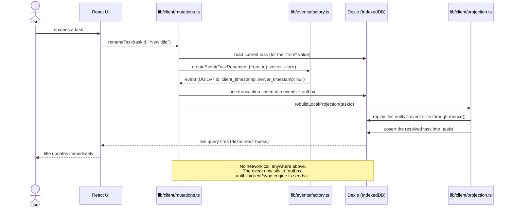
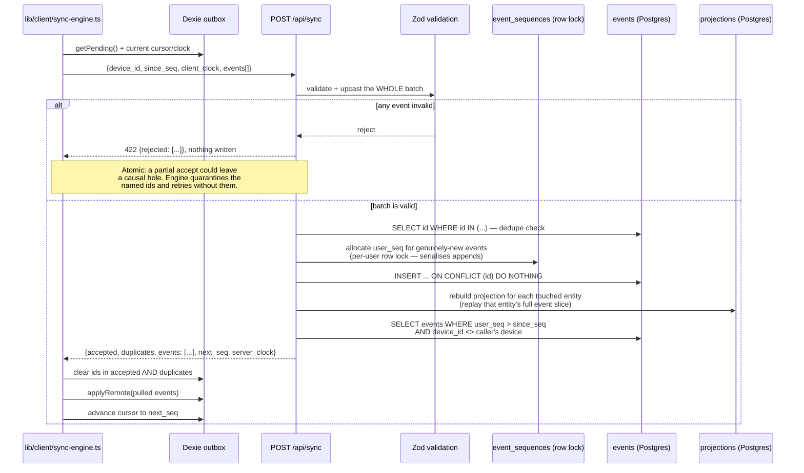
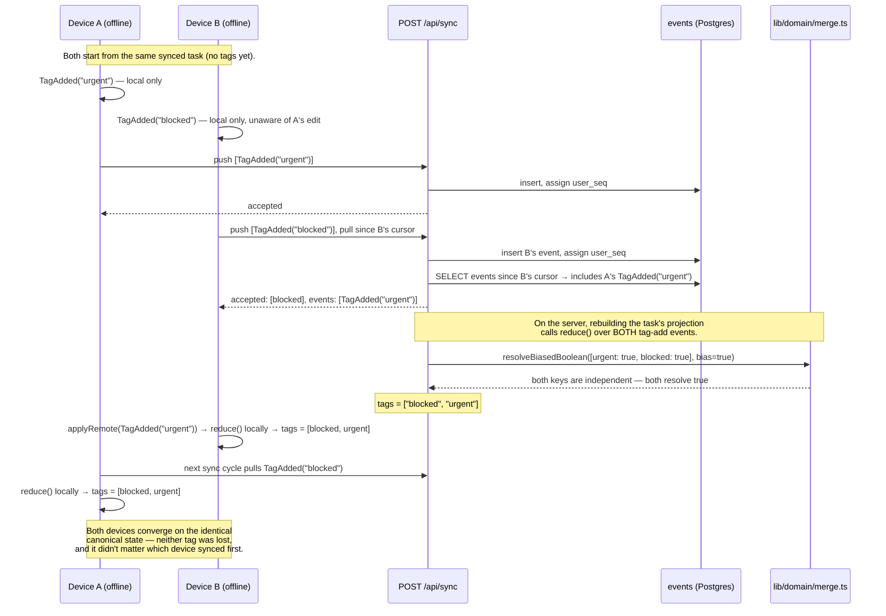

# Architecture

Three sequence diagrams covering the three moments that make this app
what it is: a mutation while offline, the sync round trip that reconciles
it, and a genuine conflict merge. See [README.md](../README.md) for the
component-level architecture diagram and [DECISIONS.md](DECISIONS.md) for
why each piece is built the way it is.

## 1. A mutation while offline

Every mutation writes to Dexie first and returns before any network call
exists — this diagram has no server or network participant at all,
because none is involved.

## 2. A sync round trip

One request does both push and pull, in one server-side transaction —
this is what makes replaying the same batch after a dropped connection
safe (`accepted` and `duplicates` are both treated as "confirmed,
drop from outbox").

## 3. A conflict merge

Two devices — really, two browser contexts, each with their own Dexie
store — edit the *same* task while both are offline, then both
reconnect. Which one syncs first doesn't matter: the merge rule is a
pure function of the two writes, not of arrival order.

For a merge where the two writes touch the *same* field (e.g. two
concurrent renames), `merge.ts` doesn't have real intent to reconcile —
it falls back to a deterministic tiebreak on
`(client_timestamp, device_id, event_id)`, which is a total order over
any two events, so every device computes the identical winner regardless
of which one it heard about first. See
[DECISIONS.md](DECISIONS.md#conflict-resolution-operation-based-merge-lww-register-default)
for the full merge table.
